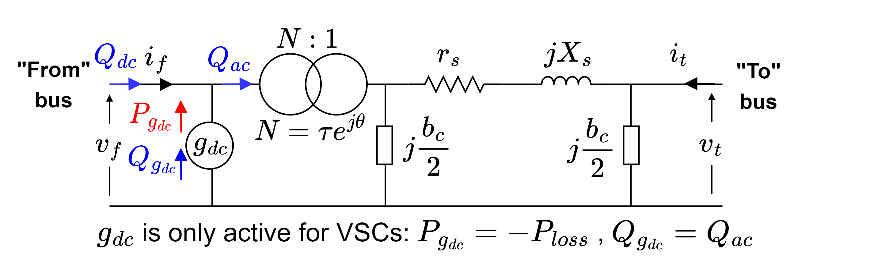

# SADRA
## A Universal AC/DC Branch Model for Optimal Power Flow Studies

**Note: the paper detailing SADRA and its operation is under review, and will be referenced here upon acceptance.**

SADRA is a new efficient universal AC/DC branch model for modelling hybrid AC/DC systems for optimal power flow studies with provisions of voltage and power controls. It  provides a framework for modelling wide variety of AC, DC and AC/DC elements including VSCs and VSC-interfaced elements (including point-to-point and multi terminal HVDC), phase-shifter and tap-changing transformers, and in general, hybrid AC/DC systems, in one compact model. SADRA provides a direct link between AC and DC grids, and therefore it is able to use conventional AC equations for modelling. Moreover, it is capable of implementing VSC control actions as well. Due to its compact and simple structure, SADRA is fast and robust.

SADRA is implemented in AIMMS, which is is an optimisation software that supports a wide range of mathematical optimization problems and provides access to multiple solvers such as IPOPT and CONOPT. AIMMS is a powerful tool for optimisation and its user friendly graphical interface makes it easy to use for implementation of optimisation problems, with minimum coding required. 
 
## The model

SADRA is an evolved version of the conventional AC branch model of MATPOWER, whereby by adding a simple *dummy generator* $g_{dc}$ at the *from* bus, modelling of hybrid AC/DC grids is made possible. It can also be regarded as an evolved, more efficient and more compact solution based on [FUBM](https://www.sciencedirect.com/science/article/pii/S0142061520319566).

Figure below shows SADRA, and as can be seen, compared to the AC branch model, only a dummy generator is added to the * *from* * bus. In contrast with the traditional VSC models, both AC and DC grids are physically connected when modelled using SADRA, and therefore only AC OPF equations are used, with the addition of two constraints per VSC to keep the DC grid *DC*  (i.e. with no reactive power flow), and to model the VSC losses. 

## How to Start
 
A fully functional model of AC OPF and its explanation is previosuly published in AIMMS Academy website and is available for the interested readers in [this link](https://how-to.aimms.com/Articles/510/opf.html).

## The provided model
To prove SADRA's performance, versatility and speed, a large AC/DC systems with 3120 AC and 5 DC buses is implemented here. 

In order to run the model, you need to:
1. install AIMMS!
2. import the data (case) file, via Data/Load Case
3. run the optimisation, either by pushing F6, or via Page Manager/Case Dta and by clicking on Solve OPF!

## Contact
  If you have any questions or comments, please contant Dr Mahmoud Shahbazi at mahmoud.shahbazi@durham.ac.uk 
