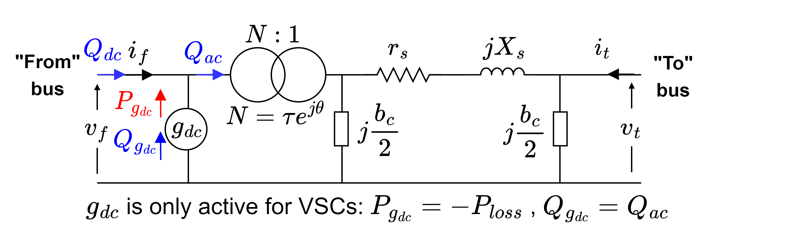

# SADRA
## Julia (based on PowerModels) and AIMMS Implementation of a Universal AC/DC Branch Model for Optimal Power Flow Studies

SADRA is an efficient universal AC/DC branch model for modelling hybrid AC/DC systems for optimal power flow studies with provisions of voltage and power controls. It provides a framework for modelling a wide variety of AC, DC and AC/DC elements including VSCs and VSC-interfaced elements (including point-to-point and multi-terminal HVDC), phase-shifter and tap-changing transformers, and in general, hybrid AC/DC systems, in one compact model. SADRA provides a direct link between AC and DC grids, and therefore it is able to use conventional AC equations for modelling. Moreover, it is capable of implementing VSC control actions as well. Due to its compact and simple structure, SADRA is fast and robust.

The method is described in:

> M. Shahbazi, "An Efficient Universal AC/DC Branch Model for Optimal Power Flow Studies in Hybrid AC/DC Systems," *IEEE Transactions on Power Systems*, vol. 40, no. 4, pp. 3211-3221, July 2025. DOI: 10.1109/TPWRS.2024.3514815

## The model

SADRA is an evolved version of the conventional AC branch model of MATPOWER, whereby by adding a simple *dummy generator* $g_{dc}$ at the *from* bus, modelling of hybrid AC/DC grids is made possible. It can also be regarded as an evolved, more efficient and more compact solution based on [FUBM](https://www.sciencedirect.com/science/article/pii/S0142061520319566).

The figure below shows SADRA, and as can be seen, compared to the AC branch model, only a dummy generator is added to the *from* bus. In contrast with the traditional VSC models, both AC and DC grids are physically connected when modelled using SADRA, and therefore only AC OPF equations are used, with the addition of two constraints per VSC to keep the DC grid *DC* (i.e. with no reactive power flow), and to model the VSC losses.



## Implementations

This repository contains two implementations of SADRA:

| Folder | Implementation | Description |
|--------|----------------|-------------|
| [`julia/`](julia/) | Julia / PowerModels | A package built on [PowerModels.jl](https://github.com/lanl-ansi/PowerModels.jl), with full VSC control modes and controlled transformers, validated against the AIMMS reference and PowerModelsACDC. |
| [`aimms/`](aimms/) | AIMMS | The original reference implementation in AIMMS. |

### Julia / PowerModels implementation (`julia/`)

A PowerModels.jl implementation of SADRA for hybrid AC/DC optimal power flow, including the full set of converter control actions. It transforms a case (in PowerModelsACDC format, or the MATPOWER-FUBM format used by the paper's 1354-bus PEGASE case) into an augmented pure-AC network and solves it with the standard PowerModels machinery.

```julia
using SADRA, Ipopt, JuMP
opt = optimizer_with_attributes(Ipopt.Optimizer, "tol" => 1e-6)

# Uncontrolled AC/DC OPF (PowerModelsACDC-format case)
result = solve_sadra_opf("case3120sp_acdc.m", opt;
                         setting = Dict("sadra_controls" => false))

# Controlled AC/DC OPF (FUBM-format case with control actions)
result = solve_sadra_fubm("sadra_case1354pegase_2MTDC_ctrls.m", opt)

println(result["objective"])
```

The Julia implementation has been validated against two independent references: it reproduces the **AIMMS reference** on the controlled 1354-bus PEGASE case (all five VSC control modes plus controlled phase-shifting and tap-changing transformers, objective 74,037.87), and reproduces **PowerModelsACDC**'s uncontrolled AC/DC OPF to within 0.003% on the 3120-bus benchmark. See [`julia/VALIDATION.md`](julia/VALIDATION.md) for the full numbers, reproduction steps and limitations, and [`julia/README.md`](julia/README.md) for usage.

### AIMMS implementation (`aimms/`)

SADRA is implemented in AIMMS, an optimisation software that supports a wide range of mathematical optimization problems and provides access to multiple solvers such as IPOPT and CONOPT. AIMMS is a powerful tool for optimisation and its user-friendly graphical interface makes it easy to use, with minimum coding required.

A fully functional model of AC OPF and its explanation is published on the AIMMS Academy website, available [here](https://how-to.aimms.com/Articles/510/opf.html).

To prove SADRA's performance, versatility and speed, a large AC/DC system with 3120 AC and 5 DC buses is implemented. To run the model:

1. Install AIMMS.
2. Download the project and open it in AIMMS.
3. Import the data (case) file via Data / Load Case.
4. Run the optimisation, either by pressing F6, or via Page Manager / Case Data and clicking Solve OPF.


## Contact

If you have any questions or comments, please contact Dr Mahmoud Shahbazi at mahmoud.shahbazi@durham.ac.uk

### Acknowledgment

Thanks to Abraham Alvarez-Bustos for his work on the FUBM implementation.
